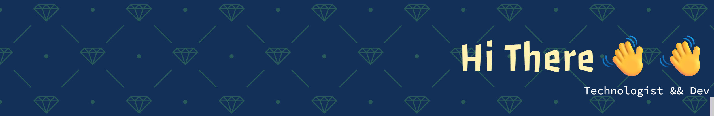

## It's so nice to have you here🤩

<!--
**AhmadRidho01/AhmadRidho01** is a ✨ _special_ ✨ repository because its `README.md` (this file) appears on your GitHub profile.

Here are some ideas to get you started:

- 🔭 I’m currently working on ...
- 🌱 I’m currently learning ...
- 👯 I’m looking to collaborate on ...
- 🤔 I’m looking for help with ...
- 💬 Ask me about ...
- 📫 How to reach me: ...
- 😄 Pronouns: ...
- ⚡ Fun fact: ...
-->

- 🔭 I’m currently working on:

  > **WartOL** | _Mini project - a website for an online store designed._ | https://ahmadridho01.github.io/WartOL/

  > **FoodSci Hub** | _Project - Building a repository platform that focuses on food safety standards (GMP, HACCP, ISO 22000) and nutritional analysis of food ingredients._ | https://ahmadridho01.github.io/gitWebsiteTekpang/

<!-- - 🌱 I’m currently learning **MongoDB** -->

#### ⚡Materials

#### 📫Connect with Me

### Entertain Section😄

<!-- <h3 align="left">Entertain Section😄</h3> -->

###

<picture>
  <source media="(prefers-color-scheme: dark)" srcset="https://raw.githubusercontent.com/AhmadRidho01/AhmadRidho01/output/pacman-contribution-graph-dark.svg">
  <source media="(prefers-color-scheme: light)" srcset="https://raw.githubusercontent.com/AhmadRidho01/AhmadRidho01/output/pacman-contribution-graph.svg">
  
</picture>

###
